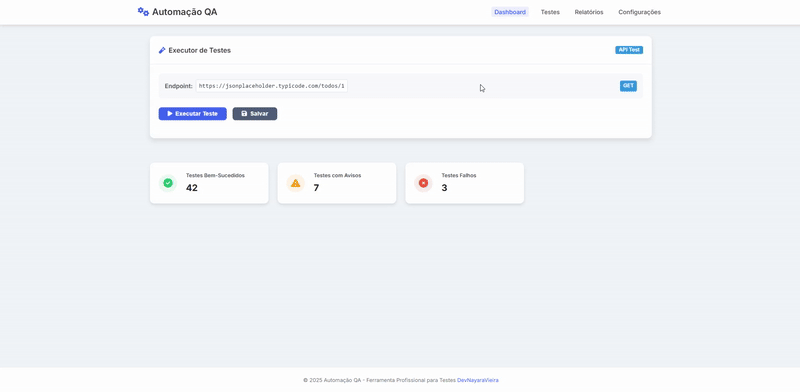

# 🚀 Automação QA - Plataforma de Testes API


> Plataforma web moderna e eficiente para execução, monitoramento e análise de testes de API RESTful com interface intuitiva e métricas em tempo real.



## 📋 Sumário

- [✨ Características](#-características)
- [🔧 Tecnologias Utilizadas](#-tecnologias-utilizadas)
- [🏗️ Arquitetura](#️-arquitetura)
- [🔍 Estrutura do Projeto](#-estrutura-do-projeto)
- [⚙️ Instalação e Configuração](#️-instalação-e-configuração)
- [🖥️ Uso](#️-uso)
- [🧪 Exemplos de Teste](#-exemplos-de-teste)
- [📊 Métricas e Monitoramento](#-métricas-e-monitoramento)
- [🔄 Roadmap](#-roadmap)
- [📄 Licença](#-licença)
- [👩‍💻 Desenvolvimento](#-desenvolvimento)

## ✨ Características

- **⚡ Execução de Testes em Tempo Real**: Testes síncronos com feedback imediato
- **📊 Dashboard de Métricas**: Visualização clara de testes bem-sucedidos, avisos e falhas
- **🔄 Rastreamento de Respostas**: Informações detalhadas de status, tempo de resposta e tamanho
- **📱 Design Responsivo**: Interface adaptável para desktop e dispositivos móveis
- **🌈 Feedback Visual**: Indicadores visuais claros para estados de testes (sucesso/falha)
- **⏱️ Medição de Performance**: Rastreamento preciso do tempo de resposta da API em milissegundos
- **🔍 Formatação de Resposta**: Apresentação formatada do conteúdo JSON/resposta da API
- **🛠️ Diagnóstico de Erros**: Mensagens de erro detalhadas e sugestões de resolução

## 🔧 Tecnologias Utilizadas

| Categoria          | Tecnologias                                       |
|--------------------|----------------------------------------------------|
| **Frontend**       | HTML5, CSS3, JavaScript (ES6+)                    |
| **Biblioteca JS**  | jQuery 3.7.0                                      |
| **UI/UX**          | CSS Variables, Custom Properties, Flexbox, Grid   |
| **Tipografia**     | Inter (Google Fonts)                              |
| **Iconografia**    | Font Awesome 6.4.0                                |
| **Testes API**     | Fetch API (JavaScript nativo)                     |
| **Estilização**    | Design System com tokens, Sombras estratificadas  |

## 🏗️ Arquitetura

A plataforma segue uma arquitetura frontend modular com separação clara de responsabilidades:

```
┌─────────────────────────────────────┐
│            Apresentação             │
│   (HTML + CSS com Design Tokens)    │
├─────────────────────────────────────┤
│        Lógica de Aplicação          │
│     (JavaScript com jQuery)         │
├─────────────────────────────────────┤
│        Comunicação API              │
│     (Fetch API, Promises)           │
└─────────────────────────────────────┘
```

### Design System

Implementado através de CSS Variables (Custom Properties), proporciona consistência visual com:

- **Paleta de Cores**: Primária, secundária e utilitárias
- **Escalas Tipográficas**: Hierarquia definida por tamanhos e pesos
- **Sistema de Espaçamento**: Tokens escalonados (xs, sm, md, lg, xl)
- **Elevação e Profundidade**: Sistema de sombras estratificadas
- **Componentes Reutilizáveis**: Cards, botões, badges e indicadores

## 🔍 Estrutura do Projeto

```
automacao-qa/
├── index.html           # Estrutura principal da aplicação
├── style.css            # Definições de estilo e design system
├── script.js            # Lógica de execução de testes e manipulação DOM
├── img/                 # Ativos de imagem incluindo favicon
└── README.md            # Documentação do projeto
```

### Componentes Principais

- **Test Panel**: Executor de testes com configuração de endpoint
- **Metrics Panel**: Visão geral das métricas de testes
- **Result Container**: Visualização formatada das respostas de API

## ⚙️ Instalação e Configuração

1. **Clone o repositório**

```bash
git clone https://github.com/seu-usuario/automacao-qa.git
cd automacao-qa
```

2. **Configuração do ambiente**

A aplicação é puramente frontend e não requer servidor backend próprio. Basta servir os arquivos estáticos:

```bash
# Usando Python (método simples)
python -m http.server 8000

# Usando Node.js com http-server
npx http-server -p 8000
```

3. **Personalização do endpoint de teste**

Abra o arquivo `script.js` e modifique a constante `API_URL` para apontar para o seu endpoint:

```javascript
// Configurações
const API_URL = 'https://sua-api.com/endpoint';
```

## 🖥️ Uso

1. Navegue até a URL de desenvolvimento (exemplo: `http://localhost:8000`)
2. A interface mostra um painel de teste com o endpoint configurado
3. Clique em "Executar Teste" para iniciar o teste da API
4. Visualize os resultados formatados, incluindo:
   - Status HTTP da resposta
   - Tempo de resposta em milissegundos
   - Tamanho da resposta
   - Conteúdo formatado da resposta

### Métricas de Monitoramento

O dashboard exibe automaticamente:
- Testes bem-sucedidos (status 2xx)
- Testes com avisos (status 3xx/4xx)
- Testes falhos (status 5xx ou erros de conexão)

## 🧪 Exemplos de Teste

```javascript
// Exemplo de teste para API RESTful de usuários
const API_URL = 'https://api.exemplo.com/v1/users';

// Parâmetros adicionais (expandir funcionalidade)
const requestOptions = {
  method: 'GET', 
  headers: {
    'Content-Type': 'application/json',
    'Authorization': 'Bearer YOUR_TOKEN'
  }
};

// Executar teste com configurações personalizadas
fetch(API_URL, requestOptions)
  .then(response => response.json())
  .then(data => console.log('Resposta:', data))
  .catch(error => console.error('Erro:', error));
```

## 📊 Métricas e Monitoramento

A plataforma registra métricas importantes para cada execução de teste:

| Métrica             | Descrição                                       | Implementação                                |
|---------------------|-------------------------------------------------|----------------------------------------------|
| **Tempo de Resposta** | Duração em ms entre requisição e resposta | `performance.now()` para medição precisa |
| **Taxa de Sucesso** | Percentual de testes bem-sucedidos | Contador incrementado após status 2xx |
| **Tamanho da Resposta** | Dimensão em bytes/KB/MB da resposta | Função `formatBytes()` para exibição |

## 🔄 Roadmap

- [ ] **Autenticação OAuth/API Keys**: Implementar mecanismos de autenticação para APIs protegidas
- [ ] **Persistência de Testes**: Salvar histórico de testes em localStorage ou backend
- [ ] **Testes Agendados**: Funcionalidade para executar testes em intervalos pré-definidos
- [ ] **Suporte a GraphQL**: Expandir capacidades para testar APIs GraphQL
- [ ] **Exportação de Resultados**: Funcionalidade para exportar relatórios em CSV/PDF
- [ ] **Comparação de Responses**: Ferramenta para comparar respostas entre diferentes versões de API

## 📄 Licença

Este projeto está licenciado sob a Licença MIT - veja o arquivo LICENSE para detalhes.

## 👩‍💻 Desenvolvimento

Desenvolvido por [DevNayaraVieira](https://portfolio-devnayaravieira.netlify.app).

---

🔗 **[GitHub](https://github.com/devnayaravieira/automacaoQA)** 
